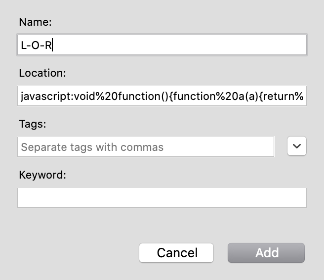

# 📚 🖼 🗺 🎲 

**library-of-randomness** (_L-O-R_) is a research tool. Use it to discover something new.
It will reward you with a random item in the extensive online archives of the
Library of Congress, Washington, DC, USA.

Pairs well with [Are.na](http://are.na/).

## Installation

1. Copy the bookmarklet code from
   [`bookmarklet.min.js`](src/bookmarklet.min.js). (A simple way to do this is
   to click on the line number, then click the `…` icon which appears, then
   click `Copy line`.)

2. Create a new bookmark named `L-O-R` (or, a name you prefer) in your browser.
   Paste the bookmarklet code into the `Location` or `URL` field.   
   
   

   
<b>Example</b>

   
   

3. Make sure to save the bookmark to your bookmarks toolbar.

## Usage

Click the bookmarklet, and wait to be redirected.

## Notes

**Due to an API limitation**, the bookmarklet cannot currently select an item from 
the full catalogue, and is limited to the first ~1% of results (~24,000 items). If
the API restriction is lifted, the bookmarklet will be changed to select from all
items. In the meantime, consider this project a 'working prototype'. (This is being
tracked in #1).

By default, _L-O-R_ limits the range of possible results to images. If
you would like to visit results of any type, change the setting `VISUAL` to
`false`, and recompile the bookmarklet.

The minified bookmarklet code has been compiled with [Bookmarkleter](https://chriszarate.github.io/bookmarkleter/).
